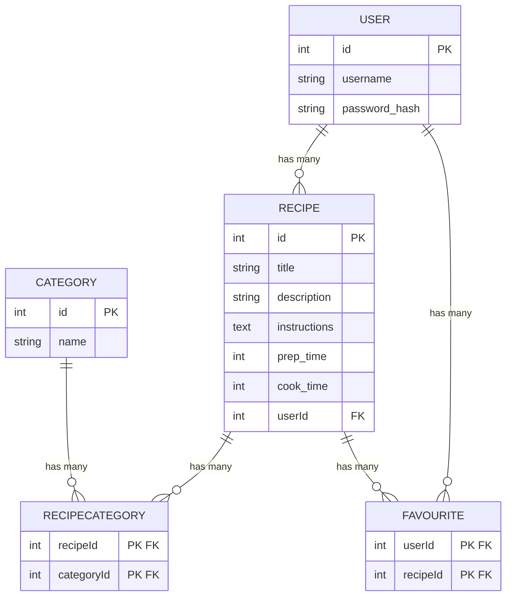

# Recipe Book

This is a simple University project, which allows the user to sign in and browse recipes. User can also add recipes to favourites or create their own.

## Database




## Running the project 

```bash
# Start the database container
docker-compose up -d

# install dependencies
pnpm install

# Start the development server
pnpm run dev

# Build the app
pnpm build

# Preview production
pnpm preview
```
