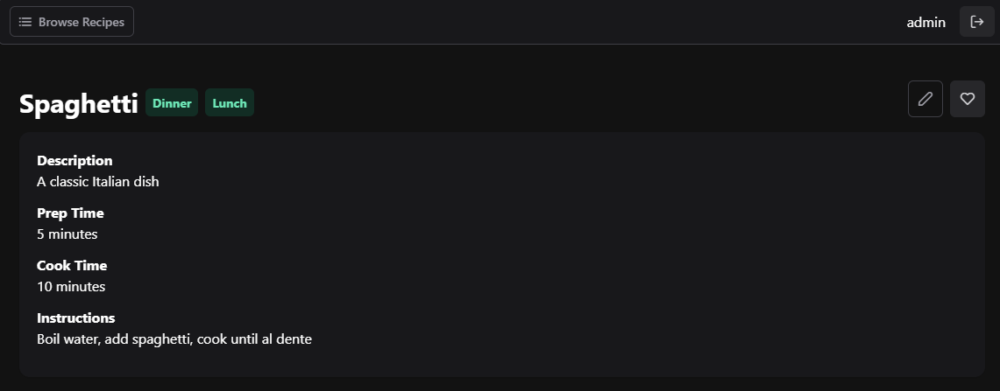

# Recipe Book

This is a simple University project, which allows the user to sign in and browse recipes. User can also add recipes to favourites or create their own.

Core technologies used:

⁠- [Nuxt.js](https://nuxt.com/) 
  - Backend: [⁠Nitro](https://nitro.build/),
  - Frontend:⁠ [Vue.js](https://vuejs.org/)
- Database: [⁠Docker](https://www.docker.com/) + ⁠[PostgreSQL](https://www.postgresql.org.pl/)

> [!TIP]
> Live Demo is available: https://recipe-book-demo.devest.dev/

## Table of Contents

- [Recipe Book](#recipe-book)
  - [Table of Contents](#table-of-contents)
  - [Running the Project](#running-the-project)
  - [Database Schema](#database-schema)
  - [API Documentation](#api-documentation)
    - [Authentication](#authentication)
    - [Recipes](#recipes)
    - [Favourites](#favourites)
    - [Categories](#categories)
  - [Views of the Application](#views-of-the-application)
    - [Sign In View](#sign-in-view)
    - [Register View](#register-view)
    - [Recipe List View](#recipe-list-view)
    - [Recipe Details View](#recipe-details-view)
    - [New Recipe View](#new-recipe-view)
    - [Edit Recipe View](#edit-recipe-view)

## Running the Project

```bash
# Start the database container
docker-compose up -d

# install dependencies
pnpm install

# Start the development server
pnpm run dev

# Build the app
pnpm build

# Preview production
pnpm preview
```

## Database Schema


## API Documentation

### Authentication

<details>
 <summary><code>POST</code> <code><b>/api/v1/auth/sign-in</b></code> - Sign in a user and return a JWT token</summary>

#### Parameters

> | name     | type     | data type | description              |
> | -------- | -------- | --------- | ------------------------ |
> | username | required | string    | The username of the user |
> | password | required | string    | The password of the user |

#### Responses

> | http code | content-type       | response                                         |
> | --------- | ------------------ | ------------------------------------------------ |
> | `200`     | `application/json` | `{"token":"string"}`                             |
> | `401`     | `application/json` | `{"code":"401","message":"Invalid credentials"}` |

#### Example cURL

> ```bash
> curl -X POST http://localhost:3000/api/v1/auth/sign-in \
>   -H "Content-Type: application/json" \
>   -d '{
>     "username": "admin",
>     "password": "admin"
>   }'
> ```

</details>

<details>
 <summary><code>POST</code> <code><b>/api/v1/auth/register</b></code> - Register a new user</summary>

#### Parameters

> | name     | type     | data type | description                  |
> | -------- | -------- | --------- | ---------------------------- |
> | username | required | string    | The username of the new user |
> | password | required | string    | The password of the new user |

#### Responses

> | http code | content-type       | response                                                                                     |
> | --------- | ------------------ | -------------------------------------------------------------------------------------------- |
> | `200`     | `application/json` | `{"status":"success","data":{"id":1,"username":"newuser","password_hash":"hashedpassword"}}` |
> | `400`     | `application/json` | `{"code":"400","message":"User already exists"}`                                             |

#### Example cURL

> ```bash
> curl -X POST http://localhost:3000/api/v1/auth/register \
>   -H "Content-Type: application/json" \
>   -d '{
>     "username": "newuser",
>     "password": "newpassword"
>   }'
> ```

</details>

### Recipes

<details>
 <summary><code>GET</code> <code><b>/api/v1/recipes</b></code> - Retrieve a list of all recipes</summary>

#### Parameters

_No parameters_

#### Responses

> | http code | content-type       | response                                                                                                                                                                                                                             |
> | --------- | ------------------ | ------------------------------------------------------------------------------------------------------------------------------------------------------------------------------------------------------------------------------------ |
> | `200`     | `application/json` | `[{"id":1,"title":"Spaghetti","description":"A classic Italian dish","instructions":"Boil water, add spaghetti, cook until al dente","prep_time":5,"cook_time":10,"categories":["Dinner"],"author":"admin","isFavorite":true}, ...]` |

#### Example cURL

> ```bash
> curl -X GET http://localhost:3000/api/v1/recipes \
>   -H "Authorization: Bearer <token>"
> ```

</details>

<details>
 <summary><code>GET</code> <code><b>/api/v1/recipes/{id}</b></code> - Retrieve a recipe by its ID</summary>

#### Parameters

> | name | type     | data type | description          |
> | ---- | -------- | --------- | -------------------- |
> | id   | required | integer   | The ID of the recipe |

#### Responses

> | http code | content-type       | response                                                                                                                                                                                                                      |
> | --------- | ------------------ | ----------------------------------------------------------------------------------------------------------------------------------------------------------------------------------------------------------------------------- |
> | `200`     | `application/json` | `{"id":1,"title":"Spaghetti","description":"A classic Italian dish","instructions":"Boil water, add spaghetti, cook until al dente","prep_time":5,"cook_time":10,"categories":["Dinner"],"author":"admin","isFavorite":true}` |
> | `404`     | `application/json` | `{"code":"404","message":"Recipe not found"}`                                                                                                                                                                                 |

#### Example cURL

> ```bash
> curl -X GET http://localhost:3000/api/v1/recipes/1 \
>   -H "Authorization: Bearer <token>"
> ```

</details>

<details>
 <summary><code>POST</code> <code><b>/api/v1/recipes</b></code> - Create a new recipe</summary>

#### Parameters

> | name         | type     | data type         | description                                          |
> | ------------ | -------- | ----------------- | ---------------------------------------------------- |
> | title        | required | string            | The title of the recipe                              |
> | description  | required | string            | The description of the recipe                        |
> | instructions | required | string            | The instructions for the recipe                      |
> | prep_time    | required | integer           | The preparation time for the recipe                  |
> | cook_time    | required | integer           | The cooking time for the recipe                      |
> | categories   | required | array of integers | The IDs of the categories associated with the recipe |

#### Responses

> | http code | content-type       | response                                                                                                                                                                                                                                |
> | --------- | ------------------ | --------------------------------------------------------------------------------------------------------------------------------------------------------------------------------------------------------------------------------------- |
> | `201`     | `application/json` | `{"status":"success","data":{"id":1,"title":"Spaghetti","description":"A classic Italian dish","instructions":"Boil water, add spaghetti, cook until al dente","prep_time":5,"cook_time":10,"categories":["Dinner"],"author":"admin"}}` |
> | `400`     | `application/json` | `{"code":"400","message":"Bad Request"}`                                                                                                                                                                                                |

#### Example cURL

> ```bash
> curl -X POST http://localhost:3000/api/v1/recipes \
>   -H "Content-Type: application/json" \
>   -H "Authorization: Bearer <token>" \
>   -d '{
>     "title": "Spaghetti",
>     "description": "A classic Italian dish",
>     "instructions": "Boil water, add spaghetti, cook until al dente",
>     "prep_time": 5,
>     "cook_time": 10,
>     "categories": [1]
>   }'
> ```

</details>

<details>
 <summary><code>POST</code> <code><b>/api/v1/recipes/{id}</b></code> Update an existing recipe</summary>

#### Parameters

> | name         | type     | data type         | description                                          |
> | ------------ | -------- | ----------------- | ---------------------------------------------------- |
> | id           | required | integer           | The ID of the recipe                                 |
> | title        | required | string            | The title of the recipe                              |
> | description  | required | string            | The description of the recipe                        |
> | instructions | required | string            | The instructions for the recipe                      |
> | prep_time    | required | integer           | The preparation time for the recipe                  |
> | cook_time    | required | integer           | The cooking time for the recipe                      |
> | categories   | required | array of integers | The IDs of the categories associated with the recipe |

#### Responses

> | http code | content-type       | response                                                                                                                                                                                                                                |
> | --------- | ------------------ | --------------------------------------------------------------------------------------------------------------------------------------------------------------------------------------------------------------------------------------- |
> | `200`     | `application/json` | `{"status":"success","data":{"id":1,"title":"Spaghetti","description":"A classic Italian dish","instructions":"Boil water, add spaghetti, cook until al dente","prep_time":5,"cook_time":10,"categories":["Dinner"],"author":"admin"}}` |
> | `400`     | `application/json` | `{"code":"400","message":"Bad Request"}`                                                                                                                                                                                                |
> | `404`     | `application/json` | `{"code":"404","message":"Recipe not found"}`                                                                                                                                                                                           |

#### Example cURL

> ```bash
> curl -X POST http://localhost:3000/api/v1/recipes/1 \
>   -H "Content-Type: application/json" \
>   -H "Authorization: Bearer <token>" \
>   -d '{
>     "title": "Spaghetti",
>     "description": "A classic Italian dish",
>     "instructions": "Boil water, add spaghetti, cook until al dente",
>     "prep_time": 5,
>     "cook_time": 10,
>     "categories": [1]
>   }'
> ```

</details>

<details>
 <summary><code>DELETE</code> <code><b>/api/v1/recipes/{id}</b></code> Delete a recipe by its ID</summary>

#### Parameters

> | name | type     | data type | description          |
> | ---- | -------- | --------- | -------------------- |
> | id   | required | integer   | The ID of the recipe |

#### Responses

> | http code | content-type       | response                                                       |
> | --------- | ------------------ | -------------------------------------------------------------- |
> | `200`     | `application/json` | `{"status":"success","message":"Recipe deleted successfully"}` |
> | `404`     | `application/json` | `{"code":"404","message":"Recipe not found"}`                  |

#### Example cURL

> ```bash
> curl -X DELETE http://localhost:3000/api/v1/recipes/1 \
>   -H "Authorization: Bearer <token>"
> ```

</details>

### Favourites

<details>
 <summary><code>POST</code> <code><b>/api/v1/favourites/toggle</b></code> - Toggle a recipe as a favorite for the current user</summary>

#### Parameters

> | name     | type     | data type | description          |
> | -------- | -------- | --------- | -------------------- |
> | recipeId | required | integer   | The ID of the recipe |

#### Responses

> | http code | content-type       | response                                                   |
> | --------- | ------------------ | ---------------------------------------------------------- |
> | `200`     | `application/json` | `{"status":"success","message":"Added to favourites"}`     |
> | `200`     | `application/json` | `{"status":"success","message":"Removed from favourites"}` |
> | `400`     | `application/json` | `{"code":"400","message":"Bad Request"}`                   |

#### Example cURL

> ```bash
> curl -X POST http://localhost:3000/api/v1/favourites/toggle \
>   -H "Content-Type: application/json" \
>   -H "Authorization: Bearer <token>" \
>   -d '{
>     "recipeId": 1
>   }'
> ```

</details>

### Categories

<details>
 <summary><code>GET</code> <code><b>/api/v1/categories</b></code> - Get a list of available categories</summary>

#### Parameters

_No parameters_

#### Responses

> | http code | content-type       | response                             |
> | --------- | ------------------ | ------------------------------------ |
> | `200`     | `application/json` | `[{"id":1, "name": "Dinner"}, ...]`  |

#### Example cURL

> ```bash
> curl -X GET http://localhost:3000/api/v1/categories \
>   -H "Content-Type: application/json" 
> ```

</details>

## Views of the application

### Sign In View


### Register View


### Recipe List View


### Recipe Details View



### New Recipe View


### Edit Recipe View


